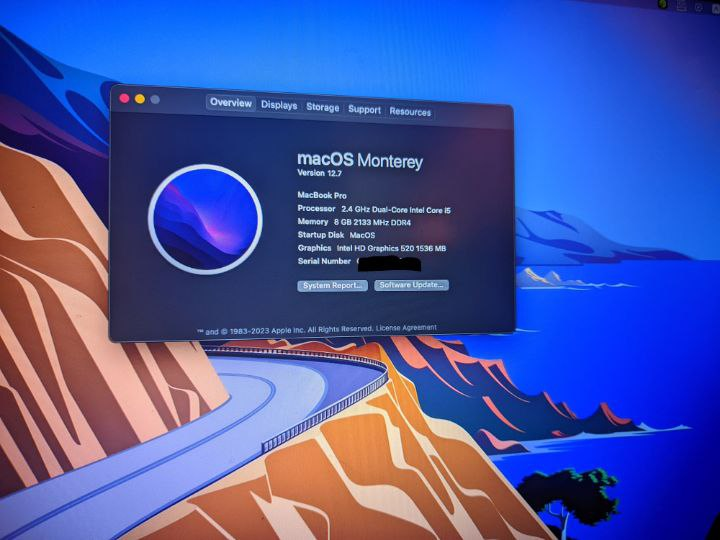
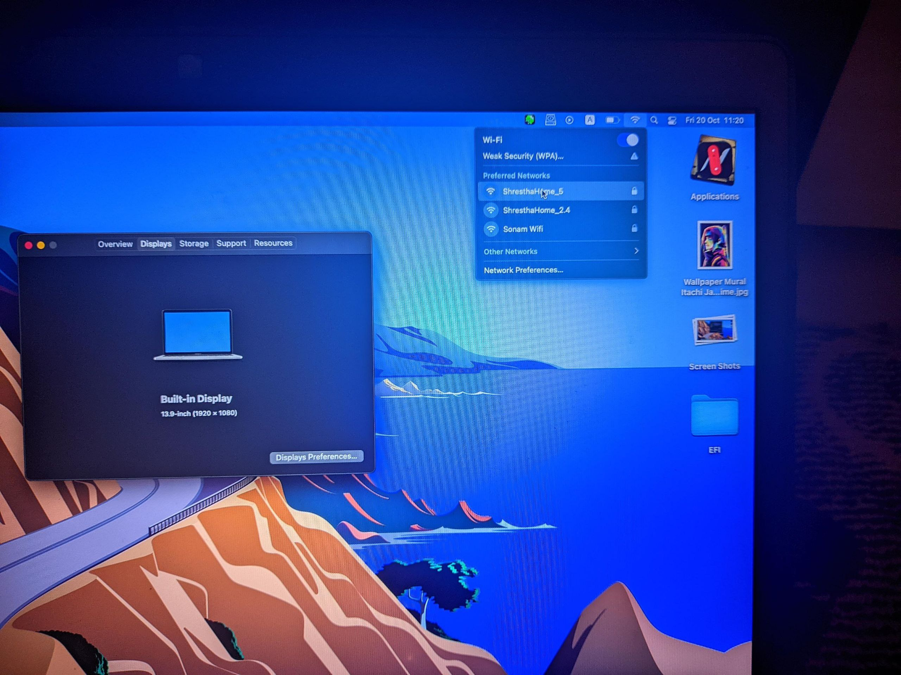

# Dell-Latitude-5480-Hackintosh-Monterey-OpenCore-0.9.9

Provided efi is working perfectely fine and is very stable for daily use 
#
This repo contains the files necessary to install Monterey in Dell latitude 5480

Patch your systems own DSDT Accordingly

# Specification 
- <b>Model</b>: Dell Latitude 5480
- <b>CPU</b>: Intel(R) Core(TM) i5-6300U CPU @ 2.50GHz
- <b>GPU</b>: Intel HD Graphics 520
- <b>RAM</b>: 16 GB 2133MHz DDR4
- <b>Storage</b>: 256GB SATA SSD
- <b>Screen</b>: 14" (1920x1080)
- <b>Wi-Fi</b>: Intel Dual Band Wireless-AC8625
- <b>Camera</b>: 720p
- <b>Touchpad</b>: Alpsalpine I2C
- <b>Battery</b>: 3-cell with inside battery 

# What's Working?
- [x] Wi-Fi & Bluetooth 
- [x] Intel HD 520 Graphics (with graphics acceleration)
- [x] HDMI port (With HDMI Audio)
- [x] Internel Speaker
- [x] Headphone Jack
- [x] Internal camera 
- [x] Trackpad (gestures work use tap to click option)
- [x] CPU Power Management 
- [x] All USB ports
- [x] Keyboard (all fn Keys)
- [x] Intel Ethernet port
- [x] iMessage, FaceTime, App Store, iTunes Store (with valid smbios)
- [x] DRM support 
- [x] SD Card Reader (Damaged so can't test)
- [x] Sleep / Wake (lid sleep and lid wake) 

# What's not working ⚠️
- [x] Airdrop (Unless you have Broadcom wifi Card)
- [x] Everything Else Work

# Refrences
- [x][dortania Hackintosh guides](https://github.com/dortania)

